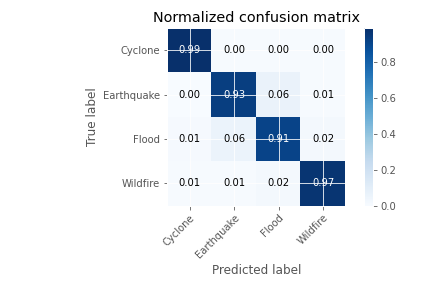

# Natural-Disaster-Detection-System-using-Deep-Learning-and-Computer-Vision-

## Introduction
The scope of this project is to develop an efficient artificial intelligence based software that can detect natural disasters from a video clip. This project utilises the concept of Computer Vision and Deep Learning to augment machines such as seismic sensor, flood sensors, etc. with a software that can detect the natural disaster and classify it in less time. This way the process of detection will become fast and the precautionary measures could be communicated to large masses in less time.

## Technologies Used
* Python 3 Google Compute Engine Backend GPU - an inbuilt Graphics Processing Unit runtime processor in Google Colaboratory Notebook
* Tensorflow
* Keras
* Scikit Learn
* Numpy
* Matplotlib
* OpenCV
* Twilio

## Functionalities
* The system shall display the classified label of the video clip to the user by writing it to the video and creating a copy of it for the user to download
* The system shall alert the user by sending notification of the predicted disaster.
* The system shall display the training loss curve, training accuracy curve, confusion matrix and classification report to the user and save it on the disk.

## Use Case Diagram

## Confusion Matrix

